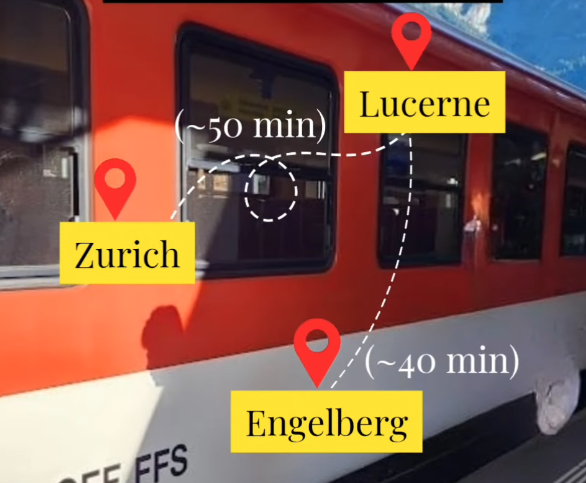

# 3 June 2026 — Lucerne & Titlis Snow Day

**Route:** Männedorf → Lucerne → Titlis → Männedorf

---

## Why Choose This Plan?

**Best for families wanting:**

- REAL SNOW EXPERIENCE ❄️
- Children, glacier experience, snow play/photos, easier logistics

**Compared to Pilatus:**

- Less scenic transport variety
- **Much better snow experience**

---

## Overall Route

Männedorf → Lucerne → Engelberg → Titlis → (return same route)

---

## Swiss Travel Pass Coverage

| Segment                  | Included?                |
|--------------------------|--------------------------|
| Männedorf → Zürich HB    | ✅ YES                   |
| Zürich HB → Lucerne      | ✅ YES                   |
| Lucerne → Engelberg      | ✅ YES                   |
| Engelberg local bus      | ✅ YES                   |
| Titlis cable cars        | ⚠️ DISCOUNTED (~50%)    |

---

## What You Must Buy

**Titlis Cable Car Ticket** (needed for gondola, Rotair cable car, glacier access)

*Swiss Travel Pass gives major discount.*

---

## Estimated Expenses

**Adults:**

| Item                   | Approx CHF   |
|------------------------|--------------|
| Titlis discounted ticket | CHF 48–60   |
| Lunch/snacks           | CHF 15–30    |
| Optional snow activities| Extra        |

**Children:**

With Swiss Family Card, many Titlis transport portions may be free or heavily discounted.

**Total Estimated Extra Cost (for 10 people):**

CHF 350–600 (depending on children ages, food, shopping)

---

## What to Carry

**VERY IMPORTANT:**

- Gloves
- Jackets
- Sunglasses
- Sunscreen
- Snacks
- Water
- Power bank

*Snow glare can be intense!*

---

## Detailed Hour-by-Hour Plan

### 6:45 AM — Wake Up

- Breakfast at Airbnb
- Carry: sandwiches, snacks, chocolates, water

---

### 7:45 AM — Leave Airbnb

- Walk to Männedorf railway station

---

### 8:03 AM — TRAIN 1 (S-Bahn)

- **Route:** Männedorf → Zürich HB
- **Included:** ✅
- **Travel:** ~25 minutes

---

### 8:35 AM — TRAIN 2 (IR70 / IC)

- **Route:** Zürich HB → Lucerne
- **Included:** ✅
- **Travel:** ~45–50 minutes

---

### 9:30 AM — Arrive Lucerne

- Quick station transfer

---

### 9:41 AM — TRAIN 3 (Zentralbahn)

- **Route:** Lucerne → Engelberg
- **Included:** ✅
- **Travel:** ~43 minutes
- *Very scenic ride*

**Tip:** Sit on the **RIGHT side** for better mountain views.

---

### 10:25 AM — Arrive Engelberg

---

### 10:25–10:40 AM — Walk or Bus to Titlis Valley Station

- Easy walk or short bus ride

---

### 10:45 AM — Titlis Ascent (Gondola + Rotair Cable Car)

- **Route:** Engelberg → Titlis
- **Not included:** ❌ (Discounted with Swiss Travel Pass ⚠️)
- Includes: gondolas, Rotair rotating cable car, glacier access

**Main Highlight:**
- Rotair Cable Car rotates slowly 360° during ascent — children usually LOVE this!

---

### 11:30 AM — Arrive Titlis (~3,000m+)

---

### 11:30 AM–3:00 PM — Titlis Snow Experience

**Main Activities:**
1. **Glacier Snow Experience ❄️** — Guaranteed snow in June. Children can touch snow, throw snow, take snow photos.
2. **Titlis Cliff Walk** — Europe’s highest suspension bridge (FREE after reaching Titlis)
3. **Glacier Cave** — Ice tunnel inside glacier (usually included)
4. **Snow Tubing / Snow Fun** — Depends on weather/opening, may cost extra

**Lunch:**
- Restaurant **or** packed picnic food (packed food is perfectly fine in open areas)

**Important Health Note:**
- At 3,000m: possible mild dizziness, headache, tiredness (especially for children/seniors)
- Drink water, move slowly

---

### 3:15 PM — Descent (Titlis → Engelberg)

- Same cable car route down

---

### 4:00 PM — Free Time in Engelberg

- Relax: coffee, chocolates, photos
- Beautiful alpine village

---

### 4:57 PM — TRAIN 4 (Zentralbahn)

- **Route:** Engelberg → Lucerne
- **Included:** ✅

---

### 5:45 PM — Arrive Lucerne

---

### 5:45–7:00 PM — Relaxed Lucerne Evening

Recommended: Chapel Bridge, lakefront, chocolates, dinner, souvenirs

---

### 7:35 PM — TRAIN 5 (IR70 / IC)

- **Route:** Lucerne → Zürich HB
- **Included:** ✅

---

### 8:30 PM — TRAIN 6 (S-Bahn)

- **Route:** Zürich HB → Männedorf
- **Included:** ✅

---

### 9:15 PM — Back at Airbnb

- Perfect ending. Children will probably say: “This was the best day.”

---

## Final Recommendation

**CHOOSE TITLIS IF:**

✅ Snow is priority
✅ Children want glacier experience
✅ Family wants snow photos/play

**CHOOSE PILATUS IF:**

✅ Scenic transport experience matters more
✅ Relaxed classic Switzerland day preferred
✅ Lake cruise important

For **REAL SNOW EXPERIENCE** — Titlis wins clearly.